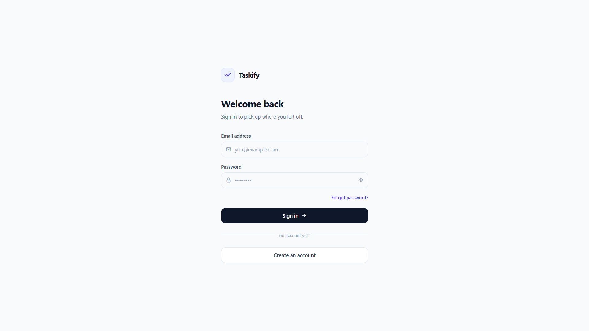
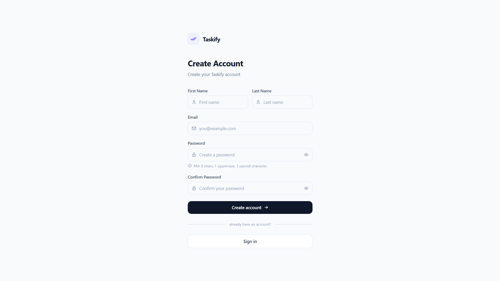
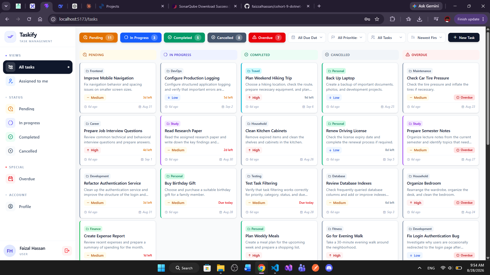
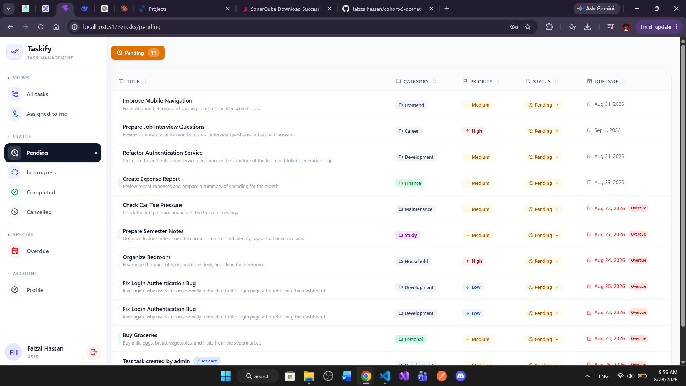
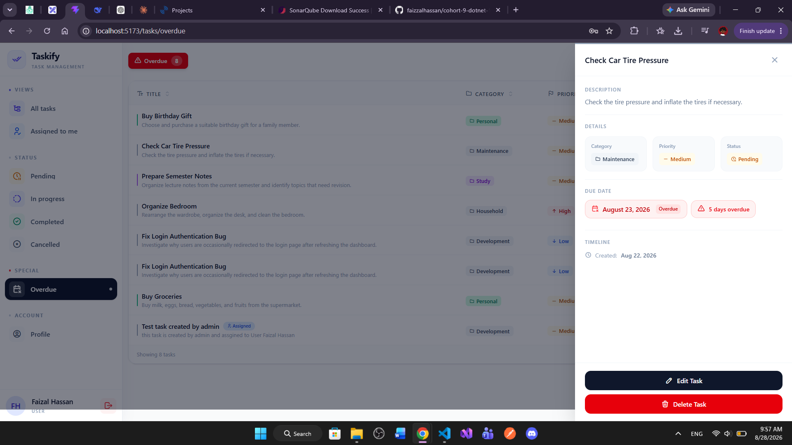
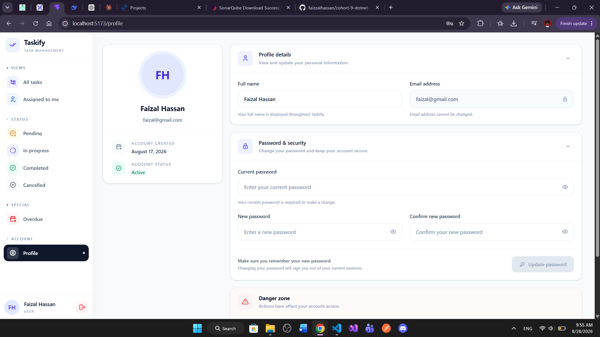
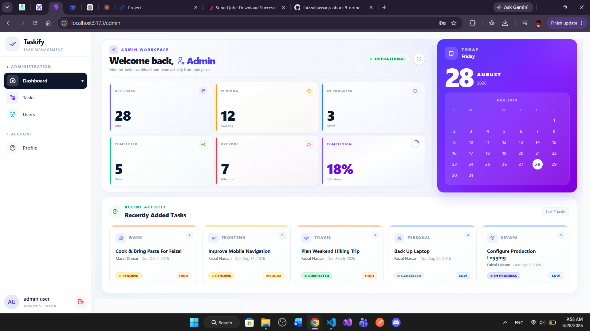
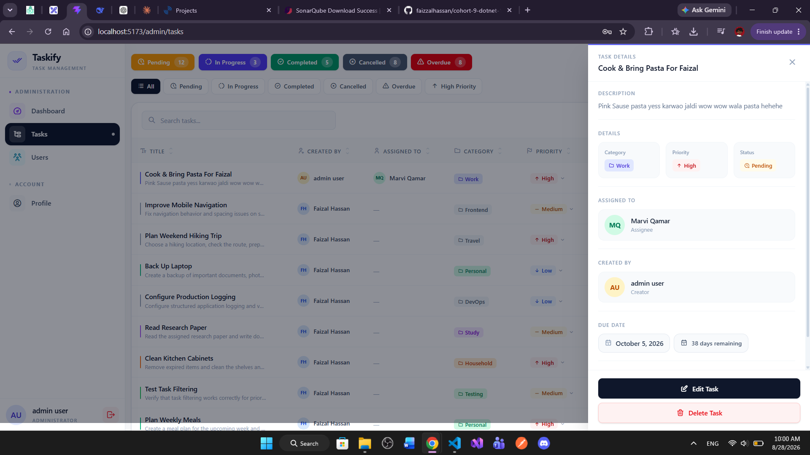

# Taskify

Taskify is a full-stack task management application built with ASP.NET Core Web API and React. It provides task management, user authentication, role-based access control, user management, profile management, and an admin dashboard.

## Features

### Authentication

- User registration and login
- JWT-based authentication
- Role-based authorization
- Secure password handling

### User Task Management

- Create, view, update, and delete personal tasks
- View and update the status of assigned tasks
- Update task status
- Task categories and priorities
- Due date management
- Automatic overdue task detection
- Soft delete for tasks
- Status-based task views

### Admin Management

- Admin dashboard with task and user statistics
- View and manage users
- Activate and deactivate user accounts
- Soft delete user accounts
- View and manage admin-created tasks
- Assign tasks to users

### Profile Management

- View profile information
- Update full name
- Change password
- Deactivate account
- Delete account

## Technology Stack

### Backend

- ASP.NET Core Web API
- .NET 10
- Entity Framework Core
- SQL Server
- JWT Authentication
- Serilog

### Frontend

- React
- Vite
- React Router
- Axios
- Tailwind CSS

### Testing and Code Quality

- xUnit
- SonarQube

## Project Architecture

Taskify follows a layered architecture:

- **Presentation Layer** – API controllers, middleware, and application configuration
- **Business Layer** – Business logic, DTOs, services, and validations
- **Repository Layer** – Database access and Entity Framework Core
- **Testing Layer** – Unit and validation tests

## User Interface

### Login Page



The login page allows users to securely sign in using their email and password.

### Registration Page



The registration page allows new users to create a Taskify account with the required account information.

### User Tasks Page



The User Tasks page provides users with a centralized view of their tasks.

- View personal tasks
- Create new tasks
- Search and filter tasks
- View task details
- Edit tasks
- Update task status
- Delete tasks

### Task Status Views



Tasks can be organized and viewed according to their current status.

- Pending
- In Progress
- Completed
- Cancelled
- Overdue

Overdue tasks are automatically identified when their due date has passed and the task has not been completed or cancelled.

### Task Details



The task details drawer displays complete information about a selected task and provides the available task management actions.

### User Profile



The profile page allows users to manage their account information.

- View account details
- Update full name
- Change password
- Deactivate account
- Delete account

### Admin Dashboard



The admin dashboard provides an overview of the system through key statistics and task and user information.

### Admin Task Management



Administrators can view and manage tasks from the admin panel, including assigning tasks to users and managing task information according to the application's authorization rules.

## Getting Started

### Prerequisites

- .NET 10 SDK
- Node.js
- SQL Server
- Git

### Backend

```bash
cd Taskify.API
dotnet restore
dotnet ef database update
dotnet run
